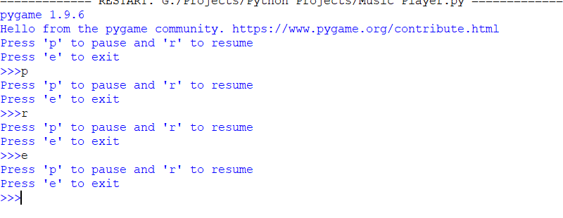
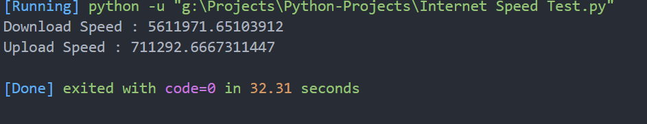
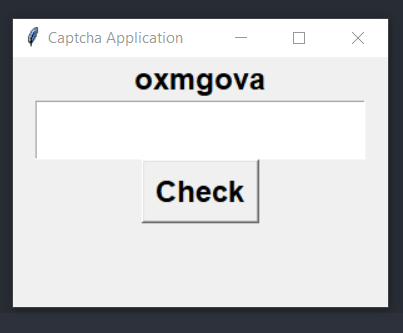
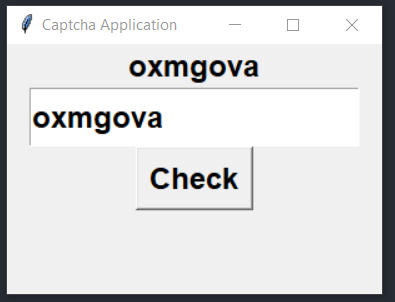
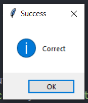
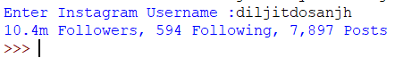
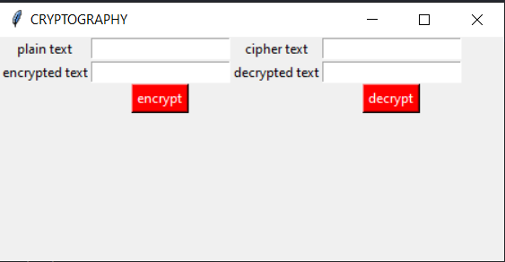
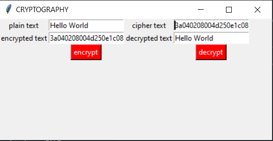
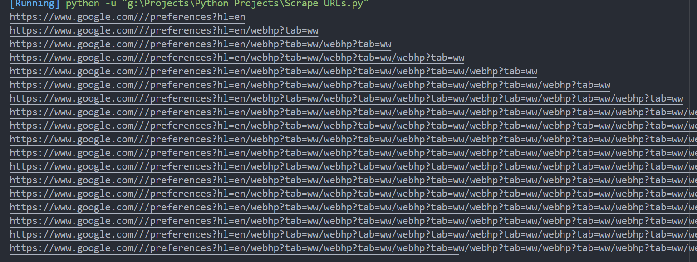

#  [Audio Book Generator](https://github.com/nikkkhil067/Python-Projects/blob/master/Audio%20Book%20Generator.py)

Requirements :  
  1. os --> `pip install os-sys`
  2. tempfile --> `pip install temp`
  3. pdf2image -->  `pip install pdf2image`
  4. warnings --> `Build in package no need to install`
  5. PIL --> `pip install Pillow >2.0`
  6. pytesseract --> `pip install pytesseract`
  7. GTTS --> `pip install gTTS`
  
# [Cartooning Image](https://github.com/nikkkhil067/Python-Projects/blob/master/Cartooning%20Images.py) 
  
Requirements :      
  1. open cv --> `pip install opencv-python`    
  2. numpy --> `pip install numpy`
    
  Output :  
   | Main Image | Edge Detected Image | Cartooned Image |
   |------------|---------------------|-----------------|
   |  |  |  |
   
# [COVID-19 Tracker](https://github.com/nikkkhil067/Python-Projects/blob/master/Covid-19%20tracker.py)

Requirements :  
  1. requests --> `pip install requests`  
  2. BeautifulSoup --> `pip install beautifulsoup4`  
  
  Output:   
    
  
# [Jarvis](https://github.com/nikkkhil067/Python-Projects/blob/master/Jarvis.py) 

Requirements :   
  1. pyttsx3 --> `pip install pyttsx3`    
  2. webbrowser --> `pip install pycopy-webbrowser`  
  3. smtplib --> `pip install secure-smtplib`  
  4. random --> `pip install random2`    
  5. speech recognition --> `pip install SpeechRecognition`
  6. wikipedia --> `pip install wikipedia`    
  7. date time --> `pip install DateTime`  
  8. wolframalpha --> `pip install wolframalpha`  
  9. os and sys --> `pip install os-sys`    
  10. pyaudio --> `pip install pipwin`         
                  `pipwin install pyaudio`  
  
# [MQTT -- Messaging  application](https://github.com/nikkkhil067/Python-Projects/blob/master/MQTT.py)

Requirements :  
  1. paho --> `pip install paho-mqtt`  
  2. time --> `Build in package no need to install`  
  
# [Music Player](https://github.com/nikkkhil067/Python-Projects/blob/master/Music_Player.py) 

Requirements :  
  1. pygame --> `pip install pygame`  

Output :    

# [QRCode Generator](https://github.com/nikkkhil067/Python-Projects/blob/master/QR%20Code%20Generator.py) 

Requirements :  
  1. pyqrcode --> `pip install PyQRCode`  
  2. png --> `pip install pypng`  
  
Output :  

# [Speech to text](https://github.com/nikkkhil067/Python-Projects/blob/master/Speech%20To%20Text.py)

Requirements :  
  1. speechrecognition --> `pip install SpeechRecognition`  
  2. pyaudio --> `pip install pipwin`       
                 `pipwin install pyaudio`  

# [Text to Audio](https://github.com/nikkkhil067/Python-Projects/blob/master/Text%20into%20Audio.py)

Requirements :   
  1. gtts --> `pip install gTTS`    
  2. playsound --> `pip install playsound`    

# [Internet Speed Test](https://github.com/nikkkhil067/Python-Projects/blob/master/Internet%20Speed%20Test.py)

Requirements :
  1. speedtest --> `pip install speedtest-cli`

Output : 

# [Captcha Application](https://github.com/nikkkhil067/Python-Projects/blob/master/Captcha%20App.py)

Requirements :
  1. tkinter --> `Build in package no need to install`
  2. random --> `Build in package no need to install`

Output :
   | Captcha Output Image          | Captcha Reading Image        | Captcha Result Image           |
   |-------------------------------|------------------------------|--------------------------------|
   |  |  |  |

# [Scrapping Instagram](https://github.com/nikkkhil067/Python-Projects/blob/master/Scrapping%20Instagram.py)

Requirements :
  1. requests --> `pip install requests`
  2. Beautiful Sopu --> `pip install beautifulsoup4`

Output :    

# [Encryption and Decryption of a Message](https://github.com/nikkkhil067/Python-Projects/blob/master/Encrpyt%20Decrypt.py)

Requirements :    
  1. one-timepad --> `pip install onetimepad`

Output :    
   | Input                                 | Output                                 |
   |---------------------------------------|----------------------------------------|
   |  |  |

# [Web Scrapping (Scrape URLs)](https://github.com/nikkkhil067/Python-Projects/blob/master/Scrape%20URLs.py)

Requirements :    
  1. requests --> `pip install requests`    
  2. Beautiful Sopu --> `pip install beautifulsoup4`      

Output :    
